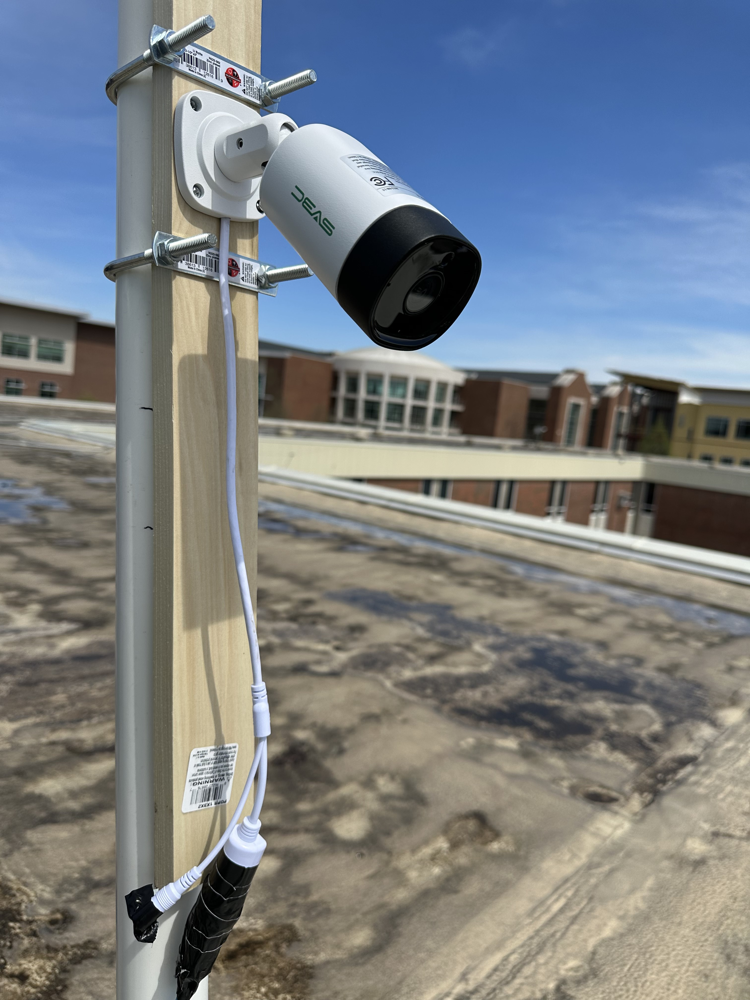
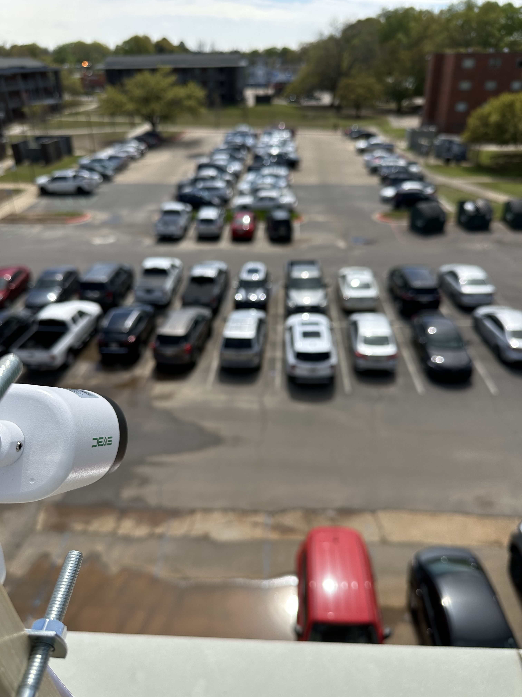
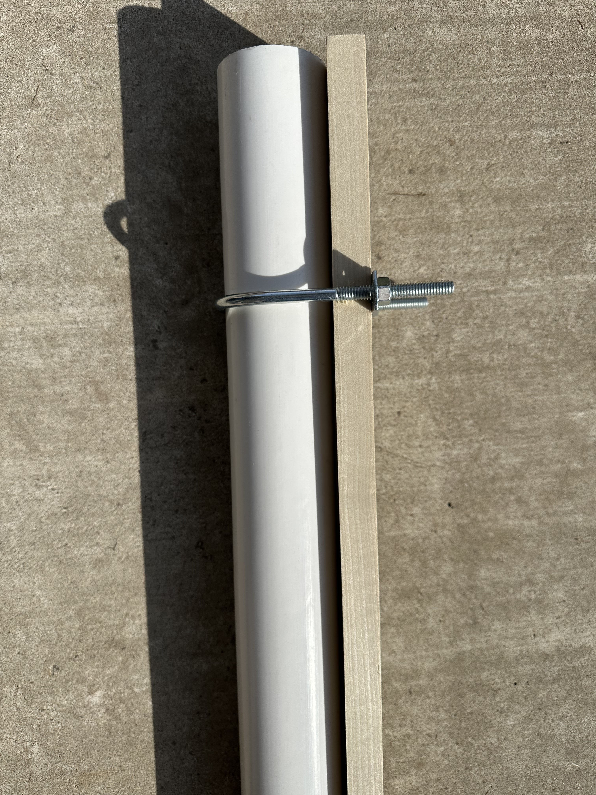
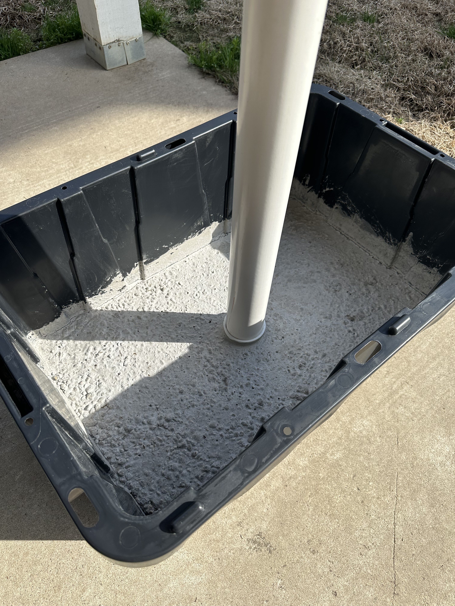

# Parking Occupancy Detection System (PODS)

## Website 
To run the front end, ensure you have Node.JS installed. 
1. Run `npm install` in the `NextJSWebserver` directory.
2. Install tailwind with the command `npm install -D tailwindcss postcss autoprefixer`.
3. Run `npm run dev` and access the website via the localhost IP (localhost:3000)

## Object Detection
### About
`/pods/object-detection/` contains the directories `datasets/`, `images/`, `mrcnn-reqs/`, `output/` and `src/`. The directories  `datasets/`, `images/`, `output/` and `src/` are mounted volumes in the docker container.
- `datasets/` containes training and testing datasets for the object detection algorithms. This directory is excluded by the `.gitignore` file, so it serves as a storage location for those datasets without tracking large amounts of data in the repository.
- `images/` contains images of the Nethken parking lot used for testing and demonstration purposes. 
- `mrcnn-reqs` contains files used to build the Mask RCNN (MRCNN) object detection library.
- `output/` contains resulting images produced by the object detection algorihtms.
- `src/` contains the source code to use, train, and test the object detection algorithms.
  - `samples/` contains sample source code from the MRCNN repositiory.
  - `main.py` is the main developing object detection program. Make a copy of this program then add your changes.
  - `demo.py` is the object detection program used for the sprint 2 retrospective presentation. Its purpose was to demonstrate the detected parking spots and missing vehicles.
  - If you need help to understand how the object detection algorithm is used, the programs `main.py`, `demo.py`, and `object-detect.py` can help.
- `dockerfile` is used to build the container enviroment for using, training, and testing the object detection algorithms. 

### Prequisites
**To run the object detection program on your computer, a NVIDIA graphics card is required.**

**Prerequisites for a Linux host computer or Linux VM that will run docker:**
1. Ensure your Linux distribution is supported here in the [NVIDIA Toolkit installation guide](https://docs.nvidia.com/datacenter/cloud-native/container-toolkit/install-guide.html).
2. Run `ubuntu-drivers devices` in a terminal. 
3. Look for the recommended NVIDIA driver and install it. For example, if my recommended driver is nvidia-driver-525, then I will install that driver using the command `sudo apt install nvidia-driver-525`.
4. Install the utilities for the recommended driver using the command `sudo apt install nvidia-utils-525`.
5. Follow the steps of the [Setting up NVIDIA Container Toolkit](https://docs.nvidia.com/datacenter/cloud-native/container-toolkit/install-guide.html) in the installation guide.

### Setup
**To use the object detection algorithm, do the following:**
1. Ensure your current directory is in root directory `pods/`. Use the command `docker-compose build` to build the dockerfile.
2. Use the command `docker-compose up -d` to start the docker container.
3. To use the docker container, use the command `docker exec -it object-detection /bin/bash`.
3. A shell will appear in the docker container. Navigate to the `src/` directory to run source code. Run the command `python <program-name>` in the docker container where `<program-name>` is replaced by a program. A working example is `demo.py`, to run it use the command `python demo.py`.

### Database
To connect to the database container, run the `run-sql.sh` script in `/object-detection/`.

To use MySQL Workbench to connect to the MySQL container, you have to be on the same wifi network as the computer running the container.

## Website Login Automation
### About
- Folder contains three files that are responsible for automating the process required to login into the PoE camera system.
  - `chromedriver.exe ` is the standalone driver used by Selenium to launch an instance of Google Chrome and automate web applications.
  - `login_automation.py` houses the script to automate the login process and save an image from the main stream to local drive.
  - `login_credentials.yml` holds the username and password information needed to have access to the camera web software.
- (The 3 files should be kept in the same directory)

### Process
Automation is powered by the following steps:
1. Store the key-value pairs within `login_credentials.yml` into separate variables within `login_automation.py`.
2. Open an instance of Google Chrome using the Selenium Webdriver framework.
3. Search the webpage by element to send the key values to the appropriate field and click the submit button.
4. Search the webpage's html file for main stream video element then copy and store its data to local storage as a .png.

## PodsApp
- Folder contains the skeleton files that are needed to begin development of the application on our local host.
- In order to test, the following should be done.
  - Be sure to pull from main.
  - In terminal navigate into PodsApp directory that contains manage.py
  - Run `python manage.py runserver` to start server
    - If Django error occurs, then make sure to `pip install django`
  - Visit the local host ip address to view the page

## Hardware
### Materials
- The camera system consists of a concrete base, pvc tubing, 1"x4" piece of wood, and the camera itself.
  - Concrete base -> An 80 lbs bag of quickset cement hand-poured into a 2'x3' mold with a 3-way connector pipe set in the center.
  - Pvc tubing -> 3-way connector pipe set in concrete, 5' long pvc pipe (3" diameter), and a cap for the pipe. All pieces of pvc were secured with pvc glue.
  - Wood -> 1"x4" piece of wood fastened to the pvc pipe via two standard U-bolts.
  - Camera -> An outdoor PoE camera screwed into the wood on the mount and tightened for the best viewing angle.
  
 
 

